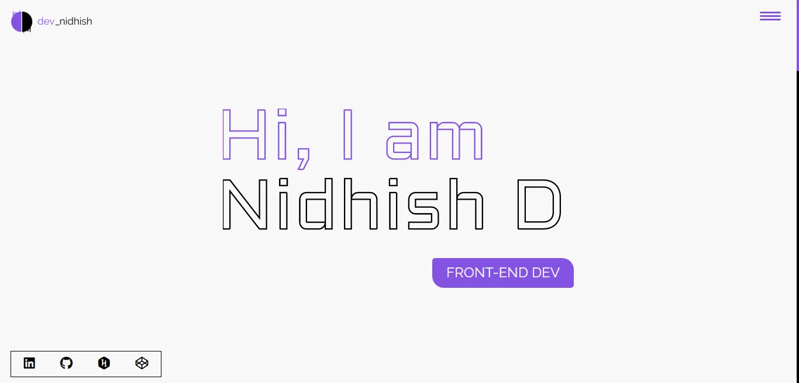

👨‍💻 My Portfolio 👨‍💻

 
 

 
 

 
 
Hey, I am Nidhish and this is my portfolio. I am very excited about the project I am doing currently and plan on creating more in the future.
I'd love to hear any suggestions and thoughts from you about the projects I have created. Thank you for checking out 😳

Here are my social links if you need to contact me 🤩

 
  
 
 
Project Link: https://nidhish-d-nayak.github.io

(<a href="#top">Back To Top</a>)

